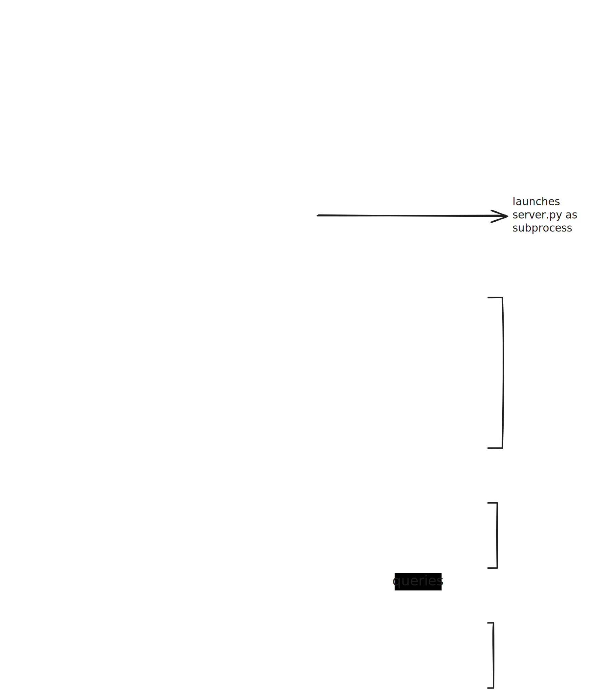

<p align = "center" draggable=”false” >
</p>

## <h1 align="center" id="heading">AI Makerspace: MCP Session Repo for Session 13</h1>

This project is a demonstration of the MCP (Model Context Protocol) server, which utilizes the Tavily API for web search capabilities. The server is designed to run in a standard input/output (stdio) transport mode.

## Project Overview

The MCP server is set up to handle web search queries using the Tavily API. It is built with the following key components:

- **TavilyClient**: A client for interacting with the Tavily API to perform web searches.

## Prerequisites

- Python 3.13 or higher
- A valid Tavily API key

## ⚠️NOTE FOR WINDOWS:⚠️

You'll need to install this on the *Windows* side of your OS. 

This will require getting two CLI tool for Powershell, which you can do as follows:

- `winget install astral-sh.uv`
- `winget install --id Git.Git -e --source winget`

After you have those CLI tools, please open Cursor *into Windows*.

Then, you can clone the repository using the following command in your Cursor terminal:

```bash
git clone https://AI-Maker-Space/AIE8-MCP-Session.git
```

After that, you can follow from Step 2. below!

## Installation

1. **Clone the repository**:
   ```bash
   git clone <repository-url>
   cd <repository-directory>
   ```

2. **Configure environment variables**:
Copy the `.env.sample` to `.env` and add your Tavily API key:
   ```
   TAVILY_API_KEY=your_api_key_here
   ```

3. 🏗️ **Add a new tool to your MCP Server** 🏗️

Create a new tool in the `server.py` file, that's it!

## Running the MCP Server

To start the MCP server, you will need to add the following to your MCP Profile in Cursor:

> NOTE: To get to your MCP config. you can use the Command Pallete (CMD/CTRL+SHIFT+P) and select "View: Open MCP Settings" and replace the contents with the JSON blob below.

```
{
    "mcpServers":  {
        "mcp-server": {
            "command" : "uv",
            "args" : ["--directory", "/PATH/TO/REPOSITORY", "run", "server.py"]
        }
    }
}
```

The server will start and listen for commands via standard input/output.

## Usage

The server provides a `web_search` tool that can be used to search the web for information about a given query. This is achieved by calling the `web_search` function with the desired query string.

## Activities: 

There are a few activities for this assignment!

### 🏗️ Activity #1: 

Choose an API that you enjoy using - and build an MCP server for it!

---
ANSWER:

## Webzio Integration

### `webzio.py`

This file contains a **Webzio** class that acts as a client for the webz.io News API. It:

- Accepts a search `query`, `sentiment` filter (positive/negative/neutral), and `language`
- Fetches news articles from the webz.io API using an API token stored in environment variables
- Has a `get_news()` method that returns raw JSON data from the API
- Has a formatted `__str__()` method that presents the results in a readable format, showing:
  - Query parameters used
  - Total results and API requests remaining
  - Top 5 articles with titles and URLs
- Can be run standalone as a command-line tool

### Integration with `server.py`

The `server.py` file is an **MCP (Model Context Protocol) server** that exposes the Webzio functionality as a tool that AI assistants can use:

1. It imports the `Webzio` class from `webzio.py`
2. It wraps it in an MCP tool decorator (`@mcp.tool()`) as the `get_news()` function
3. This exposes the news search capability through the MCP protocol, making it available to AI clients (like Claude in Cursor)
4. When called, it instantiates a Webzio object and returns the formatted string output


---

### 🏗️ Activity #2: 

Build a simple LangGraph application that interacts with your MCP Server.

You can find details [here](https://github.com/langchain-ai/langchain-mcp-adapters)!

---
ANSWER:

## LangGraph MCP Client

### `langgraph_mcp_client.py`

This file demonstrates a **LangGraph agent** that connects to and uses the MCP server tools. It showcases the complete client-side implementation:

- **MCP Connection**: Establishes a connection to the MCP server using stdio transport
  - Uses `StdioServerParameters` to configure the Python server process
  - Creates a `ClientSession` to communicate with the server
  
- **Tool Loading**: Dynamically loads all available tools from the MCP server
  - Uses `load_mcp_tools()` from `langchain_mcp_adapters` to convert MCP tools into LangChain-compatible tools
  - Makes tools like `web_search`, `roll_dice`, and `get_news` available to the agent

- **ReAct Agent**: Creates an intelligent agent using `create_agent()` with GPT-4o-mini
  - The agent can reason about which tools to use based on user queries
  - Follows the ReAct (Reasoning + Acting) pattern to solve tasks

- **Example Queries**: Demonstrates the agent's capabilities with three sample queries:
  1. Fetching AI news with positive sentiment (uses `get_news`)
  2. Rolling dice (uses `roll_dice`)
  3. Web search for information (uses `web_search`)

- **Response Display**: Shows detailed execution information including:
  - Which tools were called
  - Arguments passed to each tool
  - Final response from the agent



---
